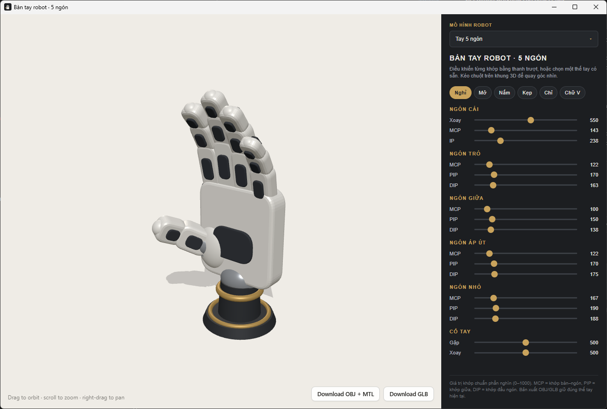

# Robot Hand Rig — 3D Joint Control & Viewer

Ứng dụng web 3D và ứng dụng Desktop (Tauri 2) mô phỏng và điều khiển trực quan các khớp của bàn tay robot 5 ngón (dạng người) và 3 ngón (gripper công nghiệp).

[](LICENSE)



---

## 🌟 Tính năng chính

- **Mô hình 3D kép & Mở rộng Động**:
  - **Tay 5 ngón**: 14+ khớp điều khiển (Ngón cái, trỏ, giữa, áp út, út) + góc gập/xoay cổ tay.
  - **Tay 3 ngón (Gripper)**: 7 bậc tự do (7 DOFs), bao gồm khớp xoay đế ngón cái và các khớp gập hành trình 0° – 180°.
- **Tương thích 100% Chuẩn URDF Robotics**: Hỗ trợ véctơ trục xoay 3D (`axis: [x,y,z]`), dải góc giới hạn vật lý (`limits: { lower, upper }`), khớp xoay (`revolute`), khớp trượt (`prismatic`) và khớp liên động (`mimic`).
- **Đơn vị Chuẩn Phần Nghìn (0–1000)**: Thanh trượt và file Pose lưu trữ góc theo dải chuẩn phần nghìn (0–1000).
- **Điều khiển trực quan**: Thanh trượt điều chỉnh góc quay từng khớp theo độ chính xác thời gian thực.
- **Thế tay định sẵn (Presets)**: Nghỉ, Thẳng đứng, Mở, Nắm, Kẹp, Chỉ, Chữ V.
- **Xuất file 3D**: Cho phép xuất mô hình theo thế tay hiện tại ra file `.obj` hoặc `.glb`.
- **Hoạt động Offline 100%**: Tích hợp Three.js local, không phụ thuộc kết nối mạng hay CDN.
- **Cross-Platform App**: Đóng gói ứng dụng Desktop mượt mà, dung lượng nhẹ bằng Tauri 2 (Rust).

---

## 📁 Cấu trúc dự án

```text
hrhand-app/
├── LICENSE                   # Giấy phép nguồn mở MIT
├── README.md                 # Tài liệu hướng dẫn dự án
├── package.json              # Cấu hình dự án & dependency CLI
├── public/assets/            # Thư mục lưu trữ assets mô hình 3D (.glb)
│   ├── robot-hand5.glb       # Model 3D tay 5 ngón
│   └── robot-hand3.glb       # Model 3D tay 3 ngón
├── src/                      # Frontend web application
│   ├── App.vue               # Layout chính ứng dụng Vue 3
│   ├── components/
│   │   ├── ThreeStage.vue    # Vue component quản lý Three.js viewer & export OBJ/GLB
│   │   └── ControlPanel.vue  # Vue component bảng điều khiển khớp & menu thả xuống
│   ├── models/
│   │   ├── hand-loader.js    # Nạp & rig mô hình 3D tổng quát từ GLB và JSON
│   │   ├── profiles.js       # Central Model Registry tự động theo config.name
│   │   ├── configs/          # Tệp cấu hình JSON mô tả khớp 3D (robot-hand5.json, robot-hand3.json)
│   │   └── poses/            # Tệp lưu trữ thế tay mẫu JSON (robot-hand5-poses.json, ...)
├── scripts/
│   ├── update_config_from_urdf.py  # Đồng bộ config JSON từ file URDF chuẩn ROS
│   └── examples/              # File .urdf mẫu & mapping để test script
└── src-tauri/                # Đóng gói Desktop App (Tauri 2 + Rust)
    ├── Cargo.toml
    ├── tauri.conf.json
    └── src/main.rs
```

---

## 🛠️ Hướng Dẫn Thêm Bàn Tay Robot Mới (3 Bước)

Dự án được thiết kế **động 100% (Fully Dynamic)**. Để thêm một bàn tay robot mới vào hệ thống:

1. **Thêm file GLB 3D:**
   Đặt file mô hình 3D `my-new-robot.glb` vào thư mục `public/assets/`.
2. **Thêm file JSON Cấu hình & Poses:**
   - Tạo file `my-new-robot.json` trong `src/models/configs/`.
   - Tạo file `my-new-robot-poses.json` trong `src/models/poses/`.
3. **Đăng ký vào Central Registry (`src/models/profiles.js`):**
   ```javascript
   import newRobotConfig from './configs/my-new-robot.json';
   import newRobotPoses from './poses/my-new-robot-poses.json';

   export const PROFILES = {
     [hand5Config.name]: createProfile(hand5Config, hand5Poses),
     [hand3Config.name]: createProfile(hand3Config, hand3Poses),
     [newRobotConfig.name]: createProfile(newRobotConfig, newRobotPoses),
   };
   ```
👉 Giao diện ứng dụng và menu chọn mô hình (Dropdown Select) sẽ **tự động phát hiện và hiển thị bàn tay mới** mà không cần sửa bất kỳ dòng code Vue/JS nào!

---

## 📐 Cấu Trúc Schema JSON Chuẩn URDF Mẫu

Tệp JSON cấu hình mô tả động học bàn tay tương thích 100% với chuẩn **URDF Robotics**:

```json
{
  "name": "robot-hand5",
  "displayName": "Tay 5 ngón",
  "title": "Bàn tay robot · 5 ngón",
  "subtitle": "Điều khiển từng khớp bằng thanh trượt, hoặc chọn một thế tay có sẵn.",
  "hint": "Giá trị khớp chuẩn phần nghìn (0–1000).",
  "defaultPose": "Nghỉ",

  "fingers": [
    {
      "key": "thumb",
      "label": "Ngón cái",
      "rootNode": "thumb",
      "joints": [
        {
          "name": "thumb_cmc_mount",
          "label": "Xoay",
          "type": "revolute",
          "axis": [0, 0, 1],
          "limits": { "lower": 25, "upper": 85 }
        },
        {
          "name": "thumb_joint1",
          "label": "MCP",
          "type": "revolute",
          "axis": [1, 0, 0],
          "limits": { "lower": 0, "upper": 70 }
        },
        {
          "name": "thumb_joint2",
          "label": "IP",
          "type": "revolute",
          "axis": [1, 0, 0],
          "limits": { "lower": 0, "upper": 80 }
        }
      ]
    },
    {
      "key": "wrist",
      "label": "Cổ tay",
      "rootNode": "wrist_pivot",
      "joints": [
        {
          "name": "wrist_pivot",
          "label": "Gập",
          "axis": [1, 0, 0],
          "limits": { "lower": -35, "upper": 35 }
        },
        {
          "name": "wrist_pivot",
          "label": "Xoay",
          "axis": [0, 1, 0],
          "limits": { "lower": -45, "upper": 45 }
        }
      ]
    }
  ]
}
```

### Chi tiết các thuộc tính khớp trong JSON:

| Thuộc tính | Kiểu dữ liệu | Ý nghĩa & Mô tả chuẩn URDF | Giá trị Mặc định (Fallback) |
| :--- | :--- | :--- | :--- |
| **`name`** | String | Tên chính xác của node 3D trong file `.glb` | *Bắt buộc* |
| **`label`** | String | Tên hiển thị của khớp trên thanh trượt giao diện | Lấy theo `name` |
| **`axis`** | Array `[x,y,z]` | Véctơ trục quay 3D trong không gian local | `[1, 0, 0]` |
| **`limits.lower`** | Number | Giới hạn góc quay tối thiểu (độ °) | `0` |
| **`limits.upper`** | Number | Giới hạn góc quay tối đa (độ °) | `180` |
| **`type`** | String | Loại chuyển động: `"revolute"` (xoay) hoặc `"prismatic"` (trượt) | `"revolute"` |
| **`mimic`** | Object | Khâu liên động: `{ "joint": "target_name", "multiplier": 1.0, "offset": 0.0 }` | `null` |
| **`limits.effort`** | Number | Mô-men động cơ tối đa ($N\cdot m$) *(Reserved for Physics)* | `10.0` |
| **`limits.velocity`** | Number | Vận tốc góc tối đa ($rad/s$) *(Reserved for Physics)* | `3.0` |
| **`dynamics`** | Object | Thông số ma sát `{ "damping": 0.1, "friction": 0.05 }` *(Reserved)* | Standard defaults |

---

## 🐍 Đồng bộ Config JSON từ file URDF

Nếu robot đã có sẵn file mô tả `.urdf` chuẩn ROS, dùng script `scripts/update_config_from_urdf.py` để tự động điền `axis`, `limits` (lower/upper/effort/velocity), `type`, `dynamics`, `mimic` vào file JSON config thay vì gõ tay. Script chỉ dùng thư viện chuẩn Python (không cần `pip install`), khớp từng joint theo `name` và tự chuyển đơn vị góc từ radian (URDF) sang độ (JSON).

```bash
# Xem trước thay đổi, không ghi file
python scripts/update_config_from_urdf.py path/to/robot.urdf src/models/configs/robot-hand5.json --dry-run

# Ghi đè trực tiếp vào file config
python scripts/update_config_from_urdf.py path/to/robot.urdf src/models/configs/robot-hand5.json

# Ghi ra file khác thay vì ghi đè
python scripts/update_config_from_urdf.py path/to/robot.urdf src/models/configs/robot-hand5.json -o output.json
```

Khi tên joint trong JSON không trùng tên joint trong URDF — ví dụ 2 khớp cổ tay ("Gập" và "Xoay") dùng chung 1 node `wrist_pivot` — dùng `--map` để chỉ định tường minh:

```bash
python scripts/update_config_from_urdf.py path/to/robot.urdf src/models/configs/robot-hand5.json --map wrist.map.json
```

Với file `wrist.map.json` dạng `{ "<name>|<label>": "<tên_joint_urdf>" }`:

```json
{
  "wrist_pivot|Gập": "wrist_flex_joint",
  "wrist_pivot|Xoay": "wrist_rotate_joint"
}
```

📁 Thư mục `scripts/examples/` có sẵn file `.urdf` mẫu và file mapping khớp đúng tên với `robot-hand5.json`/`robot-hand3.json` để thử nghiệm nhanh script trước khi dùng với URDF thật.

---

## 🚀 Hướng dẫn cài đặt & Chạy ứng dụng

### Yêu cầu hệ thống
- **Node.js**: 18.x trở lên
- **Rust**: Stable toolchain (`rustup`) 1.77+
- **Python**: 3.x *(tùy chọn, chỉ cần khi dùng script `scripts/update_config_from_urdf.py`)*

### Chạy ở chế độ Development

```bash
# Cài đặt dependency CLI
npm install

# Chạy ứng dụng Desktop (Dev mode)
npm run dev
```

### Đóng gói ứng dụng (Production Build)

```bash
npm run build
```

Sau khi hoàn tất, file cài đặt (.msi, .exe cho Windows; .dmg cho macOS; .deb, .AppImage cho Linux) sẽ được tạo tại thư mục `src-tauri/target/release/bundle/`.

---

## 📄 Giấy phép (License)

Dự án này được phát hành theo giấy phép **[MIT License](LICENSE)**.
